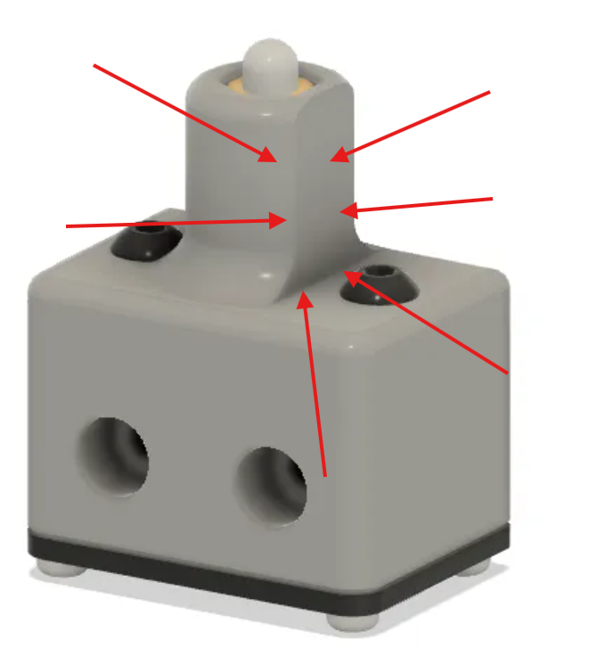
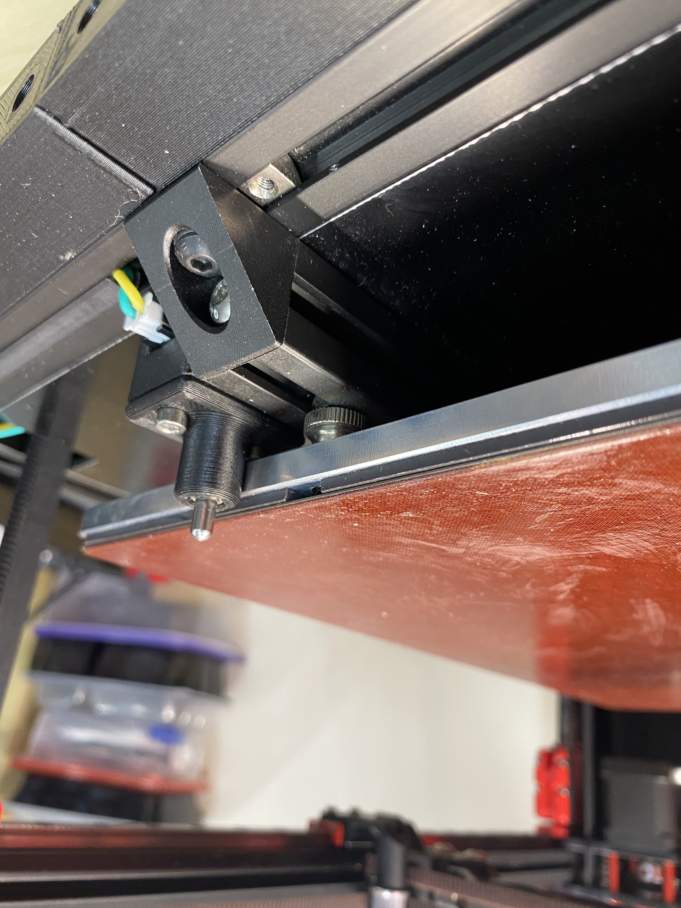
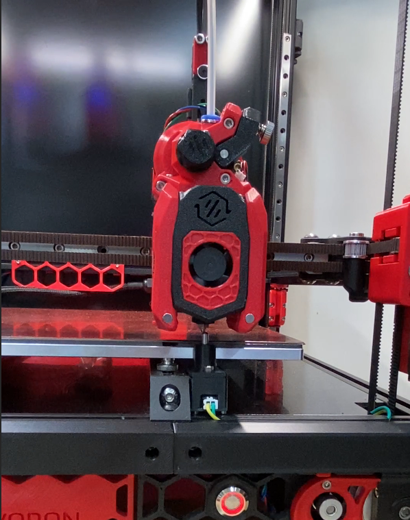

# Z-Tool-Offsets-Sex-Z-Nipple-RRF.g

  
  
  

Per-tool Z-offset calibration for the Voron 2.4 StealthChanger, using
multi-directional (N/S/E/W) probing against the "SEX-Z-Nipple" pin probe.
Ported from `viesturz/klipper-toolchanger`'s `tools_calibrate.py`
(`locate_sensor` / `calibrate_xy` / `probe_xy`), adapted to RRF meta-gcode.

This document is the stable reference: what the macro does, why it's built
this way, where every tuning constant came from, and the dated history of
bugs found and fixed. The macro file itself now carries minimal comments —
read this first before changing anything in the code.

## Dependencies

This macro is not self-contained — it relies on other files already being
correct on the machine. Check these before assuming a failure is the
macro's own fault:

- **`macros/05_discover_tool.g`** — called at startup (`M98 P"0:/macros/
  05_discover_tool.g"`) to check what's already on the shuttle via each
  tool's own OptoTap sensor, stationary, no motion. If this reports wrong
  (or a tool's OptoTap is miswired/failing), this macro's startup pickup
  logic will act on bad information.
- **`macros/041_define-global-vars.g`** — must have already run (it's
  wired into `config.g`'s boot sequence, line ~269) before this macro is
  called, since three globals are read directly: `global.dock_safe_y_empty`,
  `global.dock_safe_y_loaded`, `global.speed_xy_fast` — all used only in
  the startup positioning block, not the calibration logic itself. **Note:**
  a second file, `macros/001_define-global-vars.g`, defines the same three
  globals with identical values but is never actually called anywhere
  (confirmed 2026-07-17 — only referenced in stale comments inside
  `tfree0.g`/`tfree2.g`). Not currently causing any problem since both
  files agree, but if `041`'s values are ever changed and `001` isn't kept
  in sync, this macro would silently keep using whichever one actually ran.
- **`config.g`'s `M558 K1` definition** (line ~87) — the SEX-Z-Nipple probe
  itself. This macro assumes K1 exists, is a plain NO/NC digital switch
  (`P8`), and is physically the pin at X250 Y1 — it doesn't verify any of
  that at runtime.
- **`config.g`'s `M584`/`M569` axis-to-driver mapping** — indirectly: the
  machine must actually be CoreXY with X and Y both homed before this macro
  runs (it checks `move.axes[N].homed`, but doesn't verify kinematics type).
- **DuetToolAlign** (X/Y tool offsets) — not a hard runtime dependency (this
  macro doesn't call it), but a scope dependency: this macro's Z-only design
  assumes DuetToolAlign already owns X/Y and stays authoritative for it. If
  DuetToolAlign is ever removed/replaced, this macro's scope decision needs
  re-examining, not just its code.

## What it does

Measures each tool's Z offset relative to T0 (the reference tool) by
touching a fixed pin probe from four horizontal directions (to find the
tool's true center on the pin, since different nozzle geometries can
contact the pin off-center) and then straight down (to measure Z at that
true center). The result is written via `G10 Pn Z...` and persisted with
`M500 P10`.

**This is a maintenance/recalibration tool, not a per-print routine.** Run
it whenever a tool breaks, gets a new hotend, or a new nozzle — not wired
into `print_start.g` or any per-print path. Matches how other StealthChanger
builders use this probe pattern (confirmed via community observation,
2026-07-14) and matches `tools_calibrate.py`'s own real algorithm
(`TOOL_LOCATE_SENSOR` once on T0, `TOOL_CALIBRATE_TOOL_OFFSET` per other
tool).

## Scope: Z ONLY — not X/Y

The N/S/E/W horizontal probing exists **only** to find where a given
tool's nozzle actually contacts the pin, so the **Z** touch lands at the
true center instead of biased off to one side. It does **not** produce a
usable X/Y tool offset. X/Y offset for this machine is owned by
**DuetToolAlign** (camera-based), already in place and more precise than
anything a pin-touch method could produce. `center_x`/`center_y` are
computed and used internally to aim the Z touch, then discarded — the
`G10` calls only ever write Z.

**If X/Y application ever shows up in a `G10` call here, that's regression** —
verify against this note before assuming it's intentional. (Scope was
corrected once already, 2026-07-14: an earlier version applied `G10 P{n}
X... Y... Z...` for T1/T2, which would have fought DuetToolAlign's own
values.)

## Hardware

**"SEX-Z-Nipple" probe**: `M558 K1`, pin `io6.in`, `config.g` line ~87.
Physically mounted at **machine X250 Y1**. A 4mm M3-threaded pin (not a
rounded ball) — measured directly 2026-07-14: 4mm diameter, ~5mm Y
clearance to the bed edge, 5-6mm protrusion above the bed (varies 2-3mm by
build plate — re-check if the plate changes).

Both `G30` (vertical) and `G38.2` (horizontal) read the same underlying
probe object regardless of physical sensor technology — confirmed no
probe-type restriction applies to either command. K1 is `M558 P8`, a plain
NO/NC digital switch, exactly the category both commands are built for.

**Toolhead OptoTap is K0**, redefined per-tool by `05_discover_tool.g` —
not the fixed pin. Every probe call in this macro explicitly specifies
`K1`; a bare `G30`/`G38.2` with no `K` would silently default to K0.

## The algorithm

1. Probe the pin from `x+`, `x-`, `y+`, `y-` (offset outward by `spread`,
   then probe inward toward the pin).
2. True center X = midpoint of the `x+`/`x-` contacts. True center Y =
   midpoint of `y+`/`y-`. Averaging opposite sides cancels out
   single-direction positioning error.
3. Probe Z straight down at that true center.
4. T0 (master) records the pin's Z at its own true center once — this is
   `master_z`, the shared reference. Every other tool's offset is
   `(that tool's own true-center Z) - master_z`.

Why N/S/E/W matters here specifically: 6 tools, 3 distinct nozzle
geometries. A single vertical touch can land slightly off-center depending
on nozzle tip shape/diameter, biasing the Z reading. This machine's pin is
also **not X/Y symmetric** — its mount is physically wider in Y near the
bed edge (see "Known limitations" below) — so X and Y are treated as
genuinely independent axes throughout, never assumed to behave the same.

## Probe commands: G30 vs G38.2

- **Vertical touches** (rough Z, final center Z) use `G30 K1 S-1`. G30 is
  fundamentally a Z-probing command (confirmed against the real RRF GCode
  dictionary) — it does not do sideways probing.
- **Horizontal touches** (X+/X-/Y+/Y-) use `G38.2 K1 X{target}` /
  `G38.2 K1 Y{target}` — Straight Probe, RRF's actual "move toward a target
  on any axis, stop on contact" command. Confirmed against
  `tools_calibrate.py`'s real `probe_xy()`/`run_probe()`/`_probe()`: the
  underlying Klipper mechanism moves ONLY along the probed axis, using the
  same physical switch registered as a per-axis endstop — G38.2 is the
  direct RRF equivalent.
- **G38.2, not G38.3**, chosen deliberately: G38.2 errors loudly if a touch
  never makes contact, instead of silently recording garbage that would
  poison `center_x`/`center_y` and every downstream Z measurement.
- **G30 has no `F` parameter** (confirmed against the dictionary — its
  params are P/X/Y/Z/H/S/K only). Vertical touch speed comes solely from
  `M558 K1`'s `F120` (2mm/s) in `config.g`. Raising it would need a
  firmware reboot and would affect every other G30 on K1 too — deliberately
  not done here.
- **G53 is NOT applied to the 18 `G38.2` calls**, unlike every `G1` move in
  this file (which are all G53-prefixed). This is a known, deliberate gap —
  see "Known limitations" below.

## Tuning constants

| Constant | Value | Provenance |
|---|---|---|
| `spread` | 4mm (was 3mm, bumped 2026-07-17) | Original 3mm sent directly by Jared Wellman, confirmed against his commit `fc41973`. Bumped to 4mm after recognizing the same "already triggered at start" failure had occurred from a fresh `spread`-based approach (T1 Y+, 2026-07-15) as well as from a mid-loop `nsew_retract`-based reapproach (T2 Y-, 2026-07-16/17) — bumping only the retract distance and leaving `spread` at the same 3mm that had already failed once was inconsistent. Zero collision risk at 4mm confirmed (same reasoning as `nsew_retract`'s bump — all NSEW motion happens at Z3-6, well clear of the bed). |
| `nsew_drop_z` | 0.25mm | Same source as `spread` (his `lower_z`). |
| `probe_samples` | 5 | **Unconfirmed** — borrowed from `klipper-toolchanger-easy`'s generic bundled example config, not verified as Jared's real live value. Steve directly watched Jared's video confirm multi-tap is real, but not the exact count. |
| `probe_retract` (vertical G30 only) | 2mm | Same generic-example provenance as `probe_samples`. Left unchanged — the vertical touch has been rock-solid (repeatable to ~2 microns run-to-run), no evidence this needs tuning. |
| `nsew_retract` (horizontal G38.2 only) | 4mm | **Deliberate deviation**, added 2026-07-17. Checked exhaustively — Jared's real config has no override for this at all, and the underlying tool's own hardcoded Python default is 2mm, same as what this was before the split. Bumped to 4mm after "probe already triggered at start" failures on horizontal retries (T1 Y+ 2026-07-15, T2 Y- 2026-07-16/17). First live test after the bump: zero failures across all 12 horizontal touches, all 3 tools. Confirmed no collision risk at 4mm in any NSEW direction at the Z3-6 probing height. |
| `traverse_speed` | 1200mm/min (20mm/s) | Matches Jared's `travel_speed: 20`. Replaced an accidental `F{spread*60}` = F180 (3mm/s) crawl bug, 2026-07-16 — 6.7× slower than intended, confirmed not a units mismatch (RRF F and Klipper speed both line up once you do the conversion correctly). |
| Horizontal `G38.2` feed | F240 (4mm/s) | 2× Jared's `speed: 2`, doubled deliberately 2026-07-15 per Steve. |
| `probe_x`, `probe_y` | 250, 1 (machine coords) | Measured directly from the physical pin, 2026-07-14. |
| `lift_z` | 4.0mm | Started conservative per Steve, 2026-07-15 — clearance between NSEW side traverses over the pin peak. |
| `final_lift_z` | 4.0mm | Park height above measured Z once a tool's routine is done. |

## Key design decisions

**Per-axis depth discovery, not per-side or whole-tool.** Each tool's
`rough_z` genuinely differs (nozzle geometry), so a flat touch depth can
clear over a shorter tool's pin tip without contact. X- runs its own
3-attempt ladder (0.25/0.5/0.75mm below `rough_z`); X+ tries whatever depth
X- succeeded at first, falling back to its own ladder only on a miss. Y-/Y+
do the identical thing independently. Steve was explicit this must be
dynamic, not a hardcoded per-tool table: *"what if I change hotends
altogether or a different nozzle style/orifice later — a static per-tool Z
drop value defeats the whole point of this process."*

**Two failure modes, disambiguated by position, not by `result`.** RRF's
`result` constant collapses every G38.2 error to "2 or greater" — no way to
tell "already triggered before the move started" from "swept the full
distance and never triggered" from that alone. Confirmed via the real
Object Model docs that `userPosition` reflects the true stop point of the
last move fed to the look-ahead buffer — so on a pre-trigger failure,
position stays at the touch's START coordinate (no motion was ever fed);
on a genuine miss, position reads the touch's TARGET coordinate (the full
commanded move completed). Comparing `move.axes[N].userPosition` against
both known coordinates (via `abs()`) reliably tells them apart — "already
triggered" hard-aborts immediately (deepening the touch would be
backwards), "genuine miss" retries at the next depth.

**Multi-sampling, no early-exit.** `G30`'s native `M558 A5 S0.01`
averaging (config.g) is real but opaque — no per-sample visibility, no way
to confirm it actually ran as expected. `G38.2` has **no equivalent
averaging at all** — confirmed against the dictionary, its A/B/C params are
just more axis-target letters, not M558's multi-probe A/S. So every touch
(horizontal and, since 2026-07-15, the vertical center touch too) is
hand-rolled: exactly `probe_samples` touches, always taken in full and
averaged — no tolerance-based "close enough" shortcut. Steve was explicit
about this after reviewing Jared's own video, which shows multiple taps per
side, not one.

**Stale tool-offset contamination, and why every tool (including T0) gets
a defensive `G10 Pn Z0`.** Confirmed empirically (not just from docs):
`move.axes[N].userPosition` equals `machinePosition + that tool's active Z
offset`. Since this macro never writes a tool's NEW offset until after all
its touches finish, a tool's OLD pre-existing offset stays active
throughout its own measurement — contaminating every reading, including the
G30 touches (which have no target coordinate for G53 to fix, so it's not
just a G53 gap). Worked example: T1's old 0.065mm offset inflated its
measured 0.451mm result; the real delta was closer to 0.386mm — real,
quantified, but didn't fully explain the whole discrepancy on its own.
Fix: `G10 Pn Z0` right after each tool's pickup is confirmed, before any
touch. T0 gets this too (decided 2026-07-16) — T0 never gets written an
offset in normal operation, but nothing *enforces* that, and a stray
nonzero T0 offset would corrupt `master_z`, silently biasing every other
tool's result with no visible error.

**`M500 P10`, not bare `M500`.** Bare `M500` does not save tool offsets at
all — confirmed against the real M500 docs, only `P10` saves offsets
established by probing. Without this the calibration would work for the
rest of the session (the `G10` call updates the live object model) then
silently revert on the next reboot.

**Persistent CSV logging**, `0:/sys/zoff_nsew_log.csv` — because DWC only
keeps console history client-side in the browser tab; nothing is retained
server-side (confirmed live: DSF's object model exposes an empty
`messages` array). Every run appends rows under one shared timestamp
(`state.time`, captured once per run) so multiple runs can be grouped in a
spreadsheet. Two row types matter for results: `S` (per-tool side averages
+ computed center) and `C` (per-tool final Z result + offset). A third
type, `T*` (`TX-`/`TX+`/`TY-`/`TY+`/`TC`), logs every individual raw tap —
added 2026-07-15 after Steve compared the macro's first results against his
manual "paper method" and found them ~7-8× larger than expected, and wanted
the raw taps behind each average, not just the average itself.

Pull the log: `curl http://192.168.1.206/machine/file/sys/zoff_nsew_log.csv`

## The repo relocation (context, not part of this macro's design)

This project's git working directory moved out of Google Drive on
2026-07-16 (Drive was corrupting files by fighting with git over the same
paths, including `.git` internals). See the root `HANDOFF.md` and
`Voron24SC/PUNCH-LIST.md` item 8 for the full story — not relevant to this
macro's own logic, noted here only because some of the fixes below were
made across that transition and referenced commits from both the old and
new clone.

## Known limitations / open items

- **G53 is not applied to the 18 `G38.2` calls.** Live-tested 2026-07-17
  via a standalone `rr_gcode` call (`G53 G38.2 K1 X155`) — confirmed
  syntactically valid, RRF accepts the combined line and executes real
  motion, no parse error. **Deliberately left unapplied anyway**: decided
  2026-07-17 that since X/Y offset is entirely DuetToolAlign's
  responsibility and this macro is Z-only, a small X/Y targeting shift from
  an active tool offset doesn't matter enough to justify the change right
  now. Revisit only if Z-offset accuracy still can't be sorted out through
  other means.
- **Y-side pre-trigger failures, root cause not fully confirmed.** Two
  separate occurrences — T1 Y+ (2026-07-15) and T2 Y- (2026-07-16/17) —
  both "probe already triggered at start" on a horizontal retry, never on
  X. Two live candidates, never physically distinguished: (1) the pin's
  mount is wider in Y near the bed edge (clearance issue), or (2) touch
  depth landing on the base/mount rather than the pin body on the Y
  approach specifically. The `nsew_retract` bump to 4mm (2026-07-17) may
  have resolved this in practice (zero failures on the next full run,
  including T2's Y- side) — but that doesn't distinguish which theory was
  right, or rule out recurrence under different conditions. A same-session
  correlated finding (electronics-bay Case Fans sitting at their 25%
  default during the exact failure window, later fixed) is a plausible
  contributor via CoreXY driver-heat coupling, but the Y-specific,
  cross-session repeatability of the failure argues more for the pin
  geometry theory — driver heat has no obvious reason to prefer Y over X.
- **`probe_samples=5`, `probe_retract=2` (vertical)** are still unconfirmed
  as Jared's real tuning — see table above.
- **Tool-count scaling deliberately deferred.** Hardcoded to exactly 3
  tools (T0 master + T1/T2), each block copy-pasted rather than driven by a
  loop over `#tools` — RRF meta-gcode has no user-defined functions, so
  this can't be a shared subroutine without real restructuring. Steve's
  call, 2026-07-14: don't generalize now — only T0/T1/T2 physically exist,
  and this macro gets rebuilt anyway once a FlexibleLayouts UI (see
  "Roadmap" below) exists to dictate the right shape for tool selection.
  When T3/T4/T5 get their own blocks: copy the per-axis depth-discovery
  pattern and the `G10 Pn Z0` defensive clear exactly — see
  `Voron24SC/PUNCH-LIST.md` item 1.

## Roadmap (Steve, 2026-07-14, still current)

1. **Now**: get this macro working as-is for T0/T1/T2 — the goal is just
   dialed-in Z-offsets and correct printing. Not blocked on any UI work.
2. **Later**: a UI on top, using **FlexibleLayouts** (plugin already
   installed on this machine) — design a button/panel layout that calls
   this macro with feedback, styled after DuetToolAlign/Axiscope. Not a
   from-scratch DWC plugin build.
3. **After that**: once the UI exists and can dictate what shape the
   underlying commands need, decompose this monolithic macro into smaller
   callable pieces (closer to how `tools_calibrate.py` itself is
   structured — `TOOL_LOCATE_SENSOR`, `TOOL_CALIBRATE_TOOL_OFFSET` as
   separate commands).

Don't over-engineer toward steps 2/3 before step 1 is validated.

## Sources

- `github.com/viesturz/klipper-toolchanger` — the repo with the real
  N/S/E/W logic (`klipper/extras/tools_calibrate.py` — ground truth;
  `tools_calibrate.md` — prose doc; `examples/calibrate-offsets.cfg` —
  generic example config, **not** confirmed as anyone's real live tuning)
- `github.com/jwellman80/klipper-toolchanger-easy` — Jared Wellman's fork/
  packaging for StealthChanger builders. `examples/easy-additions/
  calibrate-offsets.cfg` (the wired-up macro, no tuning values). `examples/
  easy-additions/user-configs/toolchanger-config.cfg` (a commented-out
  override template — same generic numbers as the bundled example, still
  not confirmed live). `klipper/extras/tools_calibrate.py` — checked
  directly 2026-07-17 for the tool's own hardcoded defaults (e.g.
  `sample_retract_dist` defaults to 2.0mm when not overridden).
- `github.com/jwellman80/V2.4Configs` (default branch `v-repo-scanner`) —
  Jared's own real, live printer config. His actual `[tools_calibrate]`
  block (sent directly to Steve, confirmed against commit `fc41973`) has
  `spread`/`lower_z`/`speed`/`travel_speed` but **no retract/sample-count
  field** — those aren't in his real config at all. His actual
  `calibrate-offsets.cfg` is a symlink outside the tracked repo, contents
  not fetchable from GitHub.
- [printables.com/model/1073728](https://www.printables.com/model/1073728-shorter-multi-tool-calibration-probe-with-4mm-dowe) —
  Jared Wellman's printable housing/mount for the pin probe itself
  ("Shorter Multi-Tool Calibration Probe with 4mm Dowel"). This is the
  physical part shown in the photos at the top of this doc.
- `docs.duet3d.com/en/User_manual/Reference/Gcodes` — the RRF GCode
  dictionary (JS-rendered, needs a real browser, not `WebFetch`). Every
  probe-command claim in this macro is verified against this, not forum
  posts or assumption.
- `docs.duet3d.com/en/User_manual/Reference/Gcode_meta_commands` — RRF
  meta-gcode syntax reference (variables, loops, expressions, functions).
- `github.com/Duet3D/RepRapFirmware/wiki/Object-Model-Documentation` —
  Object Model field reference (`userPosition`, `state.time`, etc.)
- `github.com/nic335/Axiscope` — camera-based X/Y alternative, not used
  here (DuetToolAlign fills that role instead). Its own Z routine
  (`axiscope.py`, `PROBE_ZSWITCH`) is single-point touch, not N/S/E/W —
  not the technique this macro is based on.
- `stealthchanger.com/probes/`, `stealthchanger.com/calibration/` — probe
  physical design and general walkthroughs.
- `youtu.be/gKaL7Oxud2c` — Jared Wellman's own video of this routine
  running on his hardware, referenced for confirming multi-tap sampling is
  real (not just a config option nobody uses).

## Changelog

Dated, condensed. For the full narrative (verification steps, exact
numbers from each live test, dead ends), see git log on this file and
`Voron24SC/PUNCH-LIST.md` item 4's history before this reorganization
(2026-07-17).

- **2026-07-13/14** — Initial design: N/S/E/W technique researched and
  ported from `tools_calibrate.py`. Real probe geometry measured at the
  machine. Scope corrected to Z-only (X/Y stays with DuetToolAlign).
  Startup sequence added (tool discovery, safe positioning, T0 pickup
  verification) after a gap was caught where the macro could probe with
  nothing on the shuttle.
- **2026-07-15** — First live test. Found and fixed: no-retract-between-
  touches bug (bare `G30` errored "probe already triggered" on the 2nd+
  touch of every averaging loop); bare `G30`/`G38.2` defaulting to K0 (the
  toolhead's own probe) instead of K1; horizontal touches using the wrong
  command entirely (`G30`, Z-only, can't probe sideways) — replaced with
  `G38.2`, cross-confirmed against `tools_calibrate.py`'s real source, not
  just command docs. Multi-sampling added (RRF's native averaging doesn't
  cover G38.2 at all). Per-axis depth-discovery ladder added after T2's X-
  swept full distance without touching (a real geometry difference between
  tools). Persistent CSV logging added (console history isn't retained
  server-side). Bare `M500` → `M500 P10` fixed (offsets weren't being
  saved at all). Y+ "probe already triggered at start" hit on T1 — root
  cause not resolved this session.
- **2026-07-16** — Traverse-speed crawl fixed (`F{spread*60}`=F180/3mm/s →
  named `traverse_speed`=F1200/20mm/s, a hardcoded-expression bug, not a
  deliberate choice). T0 defensive `G10 P0 Z0` added. Stale tool-offset
  contamination found and fixed (`G10 Pn Z0` before touching, for every
  tool). G53 coverage gap found on all 18 `G38.2` calls, added then
  reverted same day pending syntax confirmation.
- **2026-07-17** — G53+G38.2 combination confirmed valid via a standalone
  live test, but deliberately not re-applied (Z-only scope decision, see
  "Known limitations"). First full clean run of all three tools after the
  contamination fix: T1 offset 0.451mm (contaminated) → 0.107-0.123mm
  (clean), much closer to Steve's manual "paper method" reference of
  0.065mm. T2 hit "probe already triggered at start" on Y- mid-run
  (2nd sample of a 5-sample loop, after one clean touch) — traced to a
  correlated but likely-secondary factor (electronics-bay Case Fans at
  their 25% default during the exact failure window; also found and fixed
  a real bug where three macros had mislabeled fan numbers, controlling
  T1's own cooling fans instead of the case fans they claimed to). Split
  `probe_retract` into vertical-only (unchanged, 2mm) and horizontal-only
  `nsew_retract` (bumped to 4mm) after checking exhaustively that no larger
  confirmed Jared value exists anywhere. Next full run: zero failures
  across all 12 horizontal touches on all 3 tools, both T1 and T2 offsets
  clean and persisted (`config-override.g` verified). File reorganized
  into this folder — comments trimmed from the macro, full history moved
  here. Renamed to `Z-Tool-Offsets-Sex-Z-Nipple-RRF.g`; companion doc
  renamed to `sex-z-nipple.readme.md`. Added a "Dependencies" section
  (`05_discover_tool.g`, `041_define-global-vars.g`, `M558 K1`, CoreXY/
  homing, DuetToolAlign scope) — also caught a dead duplicate file,
  `001_define-global-vars.g`, defining the same globals but never called
  anywhere. `spread` bumped 3mm → 4mm, matching the `nsew_retract` bump
  earlier the same day — recognized both were responses to the same
  "already triggered at start" failure class (one from a fresh approach,
  one from a mid-loop retract), so leaving `spread` at the value that had
  already failed once was inconsistent.
